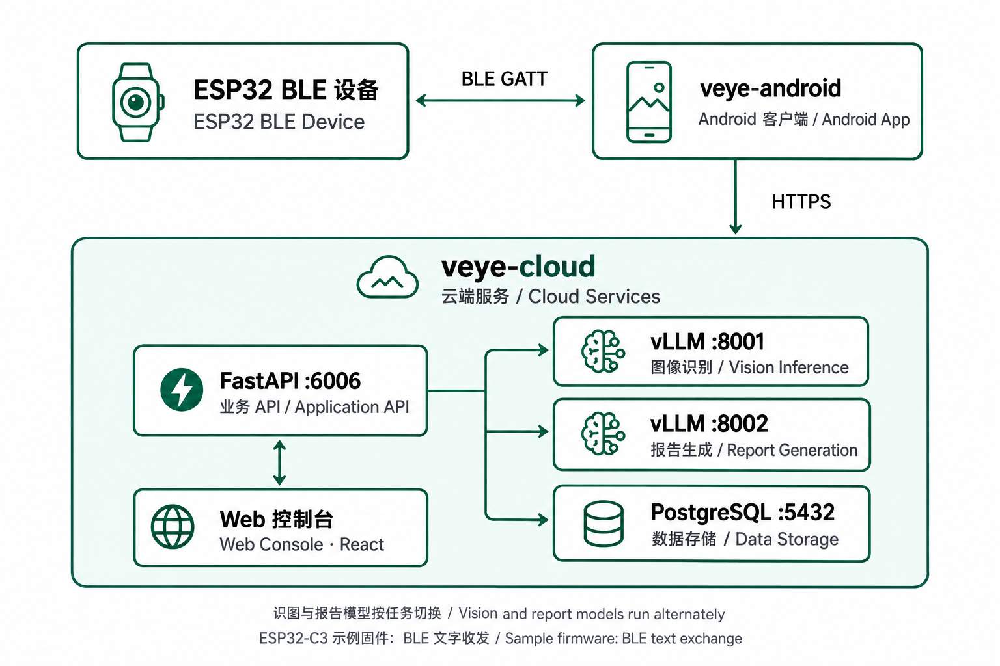

# V-Eye

**Outdoor Smart Recognition and Team Collaboration System**

[简体中文](README.md) | **English**

[](LICENSE)

V-Eye connects an Android app, ESP32 BLE devices, and cloud services for outdoor exploration and field work. It combines image recognition, location sharing, team communication, and work reports. A multimodal model analyzes images; the application API handles SOS events and team collaboration.

## Features

| Feature | Description |
| --- | --- |
| Image recognition | Identify potentially toxic plants, medicinal plants, and general scenes, with candidate labels, confidence scores, risk levels, and advice |
| BLE connectivity | Android implements GATT communication and a chunked image reception protocol; the ESP32-C3 sample firmware supports BLE text exchange for integration testing |
| Recognition history | Local records with Room, cached images, and cloud record queries |
| Team collaboration | Team creation, member invitations, group chat, map tracks, and location sharing |
| SOS reporting | Upload event details such as device, time, and location, with alerts in the client |
| AI work reports | Summarize field records using a text model, with report viewing and editing |
| Android and Web | An Android app and a React Web console share the cloud API |

## Architecture



Recognition workflow: device image → Android chunk assembly → cloud API → vision model → structured result and saved record. The complete capture and transfer workflow requires compatible hardware and firmware implementing the image protocol. The included ESP32-C3 sample does not implement camera capture or image transmission.

Report generation switches between the vision and text models through a scheduling script. While a report is being generated, image recognition returns `503 report_generation_in_progress`. The pipeline attempts to restore the vision model when it finishes.

## Repository Layout

```text
V-Eye/
├── veye-cloud/          # FastAPI, model services, PostgreSQL, and Web console
├── veye-android/        # Kotlin, Jetpack Compose, BLE, and Room
│   └── firmware/        # ESP32-C3 BLE sample firmware
├── docs/images/         # README architecture diagram
├── scripts/             # Repository utilities
├── LICENSE
├── README.md            # Chinese documentation
└── README.en.md         # English documentation
```

| Component | Responsibility | Documentation |
| --- | --- | --- |
| [veye-cloud](veye-cloud/) | Application API, model inference, and Web console | [Deployment and configuration](veye-cloud/README.md) |
| [veye-android](veye-android/) | Mobile app, BLE integration, and local data; current version `0.6.4` | [Setup and BLE protocol](veye-android/README.md) |

The Android version is defined in [version.properties](veye-android/version.properties). Component READMEs are currently in Chinese.

## Quick Start

### Prerequisites

| Component | Requirements |
| --- | --- |
| Cloud inference | Linux, a compatible NVIDIA GPU / CUDA environment, and Python 3.10+; GPU memory requirements depend on the model and vLLM configuration |
| Database | PostgreSQL; the sample script starts PostgreSQL 16 with Docker Compose |
| Web console | Node.js ≥ 18, the minimum declared by the repository |
| Android | Android Studio, JDK 17, and Android SDK 35; minimum device version is Android 8.0 (API 26). Use a physical device for BLE and location testing |

### 1. Get the Code

```bash
git clone https://github.com/HuauH-wang/V-Eye.git
cd V-Eye
```

Run the cloud commands below on a Linux GPU host. You can open the Android project on your development computer.

### 2. Configure and Start the Cloud Services

```bash
cd veye-cloud
cp .env.example .env
python3 -m venv .venv
source .venv/bin/activate
pip install -r requirements.txt
```

Edit `.env` before starting the services. Check these settings:

| Setting | Purpose |
| --- | --- |
| `DATABASE_URL` | Database connection; credentials must match the PostgreSQL configuration |
| `API_KEY` | Optional shared key for endpoints such as image recognition, record queries, and SOS submission |
| `JWT_SECRET` | Signing secret for user login tokens; replace the example value when deploying |
| `VLLM_MODEL` | Vision model ID or local directory; defaults to Qwen2.5-VL-7B-Instruct |
| `REPORT_VLLM_MODEL` | Report model ID or local directory; adapt the example AutoDL path to your host |
| `IMAGE_DIR` / `TILE_CACHE_DIR` | Image and map tile directories; the API process needs write access |
| `CORS_ALLOW_ORIGINS` | Browser origins for direct cross-origin API access; usually unnecessary with same-origin deployment or the Vite proxy |

Model startup scripts enable offline loading by default. Prepare the weights and set the correct paths first. For an initial online download using a model ID, set `HF_HUB_OFFLINE=0` and `TRANSFORMERS_OFFLINE=0` in `.env` and ensure the host can reach the model source.

The sample Compose configuration uses `veye_password` and `/data/veye/postgres`. Adapt [docker-compose.yml](veye-cloud/docker-compose.yml) to your deployment and update `DATABASE_URL` to match.

```bash
./scripts/start_postgres.sh
./scripts/model_switch.sh start_vision  # Start vision model in background and wait for readiness
./scripts/start_api.sh                 # FastAPI :6006, running in foreground
```

Keep this terminal open while the API runs. The vision model listens on `127.0.0.1:8001` by default; the report model uses `127.0.0.1:8002`. The scheduler switches models for report jobs, so both services do not need to run simultaneously. Model logs are written to `veye-cloud/logs/`.

Check from another terminal:

```bash
curl http://127.0.0.1:6006/health
curl http://127.0.0.1:8001/v1/models
```

`/health` confirms that the API responds and returns its model configuration. It does not check database connectivity or successful inference. Use the image recognition example below to verify the full request path.

### 3. Start the Web Console

Open another terminal at the repository root:

```bash
cd veye-cloud/frontend
npm ci
npm run dev
```

Visit `http://localhost:5173` locally. Leave **API Base** empty to use Vite's `/api` proxy. Its default target is `http://127.0.0.1:6006`; set `VITE_API_PROXY_TARGET` when the API runs on another host.

For AutoDL development, use `npm run dev:autodl` on port `6008`. For same-origin deployment, run `npm run build` to generate the Web app in `veye-cloud/app/static/web/`, then restart the API and open the console at the API address.

### 4. Run the Android App

1. Open `veye-android/` in Android Studio, select JDK 17, and sync Gradle.
2. Copy `local.properties.example` to `local.properties` and set `sdk.dir`. For AMap, configure an Android key matching the app's package name and signing certificate. Fill in release signing settings when packaging a release.
3. Run on a physical device. In the app's cloud connection settings (「云端连接」), enter the Base URL and API Key, such as `https://your-domain.example/`.
4. To change the built-in default URL, edit `DEFAULT_BASE_URL` in [CloudConfig.kt](veye-android/app/src/main/java/com/veye/mobile/cloud/CloudConfig.kt). The URL must end with `/`.
5. Grant the required Bluetooth, location, and notification permissions, then connect a BLE device that implements the app's protocol.

On a phone, `127.0.0.1` refers to the phone itself. Use a reachable host address or an HTTPS reverse proxy for cloud integration. See the [Android documentation](veye-android/README.md) for details.

## API Reference

After starting the service, open `http://127.0.0.1:6006/docs` for interactive API documentation. Use the running service's OpenAPI documentation for the complete parameters and response schemas.

| Endpoint | Method | Description |
| --- | --- | --- |
| `/health` | GET | API response and model configuration |
| `/vision/identify` | POST | Image recognition using `multipart/form-data` |
| `/vision/records` | GET | Query recognition records |
| `/sos` | POST | Submit an SOS event |
| `/auth/*` | Various | Registration, login, and user information |
| `/teams/*` | Various | Teams, members, invitations, and group chat |
| `/map/*` | Various | Map tiles, tracks, and location submission |
| `/reports/*` | Various | Report previews, generation jobs, and report editing |

There are two authentication mechanisms. When `API_KEY` is set, shared-key-protected endpoints require `X-API-Key`. User endpoints for teams, chat, locations, and reports require a login token in `Authorization: Bearer <token>`. `/health` does not require the shared key. A shared key does not replace user login.

### Image Recognition Example

Replace the key with the value from `.env` and use an actual image path. Remove the header if `API_KEY` is unset:

```bash
curl -X POST http://127.0.0.1:6006/vision/identify \
  -H 'X-API-Key: your-api-key' \
  -F 'image=@/path/to/plant.jpg' \
  -F 'scene=toxic_plant' \
  -F 'lang=en'
```

Supported `scene` values are `toxic_plant`, `medicine`, and `generic`. `lang` defaults to `zh-CN`; use `en` to request English recognition text. Main response fields include `label_main`, `confidence`, `candidates`, `risk_level`, `risk_tags`, `summary`, `advice`, `details`, and `latency_ms`.

## Troubleshooting

| Symptom | What to Check |
| --- | --- |
| `401 unauthorized` | The `X-API-Key` on recognition or SOS requests must match the server setting |
| `401 not_authenticated` | User endpoints need a valid Bearer login token |
| `503 database_unavailable` | Check PostgreSQL availability and `DATABASE_URL` |
| `503 report_generation_in_progress` | A report job is using the model; retry after the job finishes and the vision model is restored |
| Model fails to start | Check weight paths, offline loading settings, CUDA / vLLM compatibility, and available GPU memory |
| Web console cannot reach the API | Check API availability, the Vite proxy target, or cross-origin configuration |
| No image arrives over BLE | Check that device firmware implements the image chunk protocol; the included sample only exchanges text |

## Technology Stack

| Layer | Technologies |
| --- | --- |
| Cloud API and data | FastAPI, SQLAlchemy, PostgreSQL |
| Vision inference | vLLM + Qwen2.5-VL-7B-Instruct |
| Report generation | vLLM + Qwen2.5-7B-Instruct |
| Web UI | Vite 5, React 18, TypeScript, Leaflet / AMap |
| Android | Kotlin, Jetpack Compose, Room, Retrofit, BLE GATT |
| Sample firmware | ESP32-C3; see [firmware](veye-android/firmware/) |

## Scope and Limitations

Cloud recognition, synchronization, and SOS submission depend on network connectivity and service availability. Plant identification and risk suggestions do not establish that a plant is safe to eat or suitable for treatment. SOS submission records an event within this system and does not guarantee delivery to public emergency services.

## Contributing

Report bugs and suggest features through [Issues](https://github.com/HuauH-wang/V-Eye/issues), or submit a Pull Request. Include the affected component, version, reproduction steps, relevant logs, and any build or integration checks performed. For BLE changes, describe the device and firmware used. Remove `.env` files, tokens, signing files, and private service addresses before submitting changes.

Use a commit email linked to your GitHub account, including a GitHub-provided `noreply` address if preferred, and merge contributions into the default branch, `main`, so GitHub can associate your contributions with your account.

## License

This project is licensed under the [MIT License](LICENSE).

