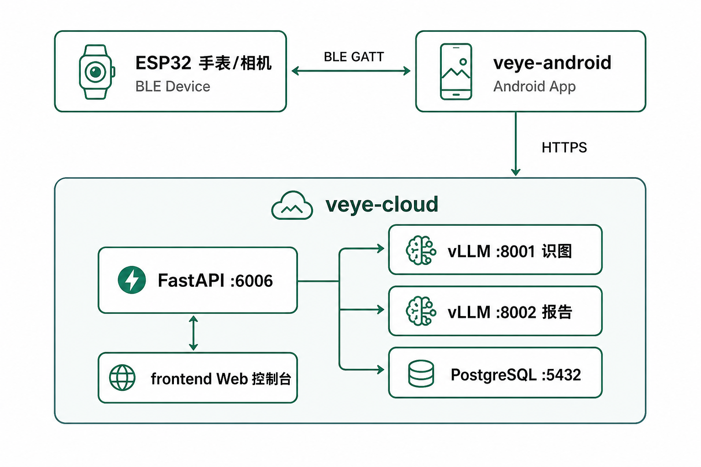

# V-Eye

[](LICENSE)

面向户外/野外场景的**智能识别与团队协作**系统。ESP32 手表/相机通过 BLE 采集图像，Android 客户端上传至云端，由多模态大模型完成识图、SOS 上报与队伍协作。

## 功能概览

- **智能识图** — 有毒植物、药用植物、通用场景识别（Qwen2.5-VL）
- **BLE 联机** — ESP32-C3 手表/相机，GATT 分片传图协议
- **团队协作** — 组队、群聊、地图轨迹、位置共享
- **SOS 上报** — 紧急情况一键上报
- **AI 报告** — 基于 LLM 的工作报告生成
- **多端支持** — Android 客户端 + Web 控制台

## 系统架构



## 仓库结构

```
veye/
├── veye-cloud/          # 云端：FastAPI + vLLM + PostgreSQL + Web 控制台
├── veye-android/        # Android：Jetpack Compose + BLE + Room
├── scripts/             # 仓库工具脚本（打包等）
├── LICENSE
└── README.md
```

| 子项目 | 技术栈 | 状态 | 文档 |
|--------|--------|------|------|
| [veye-cloud](./veye-cloud/) | FastAPI, vLLM, PostgreSQL, React | 生产可用 | [README](./veye-cloud/README.md) |
| [veye-android](./veye-android/) | Kotlin, Compose, BLE, Room | v0.6.4 | [README](./veye-android/README.md) |

## 快速开始

### 前置要求

| 组件 | 要求 |
|------|------|
| 云端 | Linux + CUDA GPU、Docker、Python 3.10+、Node.js ≥ 18 |
| Android | Android Studio、真机（BLE）、minSdk 26 |

### 1. 云端（veye-cloud）

```bash
cd veye-cloud
cp .env.example .env          # 编辑 API_KEY、DATABASE_URL 等
python -m venv .venv && source .venv/bin/activate
pip install -r requirements.txt
./scripts/start_postgres.sh   # PostgreSQL
./scripts/start_vllm.sh       # vLLM 识图模型（需 GPU）
./scripts/start_api.sh        # FastAPI :6006
```

Web 控制台：

```bash
cd veye-cloud/frontend
npm install && npm run dev    # 开发 :5173
# AutoDL 环境：npm run dev:autodl  # :6008
```

详见 [veye-cloud/README.md](./veye-cloud/README.md)。

### 2. Android（veye-android）

1. 用 Android Studio 打开 `veye-android/`
2. 配置 `app/src/main/java/com/veye/mobile/cloud/CloudConfig.kt` 中的 `BASE_URL`
3. 复制 `local.properties.example` 为 `local.properties`（签名 / 高德地图 Key）
4. 真机运行（BLE 需真机）

详见 [veye-android/README.md](./veye-android/README.md)。

## API 参考

Android / Web 共用以下 REST 端点：

| 端点 | 方法 | 说明 |
|------|------|------|
| `/health` | GET | 健康检查 |
| `/vision/identify` | POST | 图像识别（`scene`: `toxic_plant` / `medicine` / `generic`） |
| `/sos` | POST | SOS 事件上报 |
| `/auth/*` | — | 用户注册、登录、JWT |
| `/teams/*` | — | 队伍、群聊、邀请 |
| `/map/*` | — | 地图瓦片、轨迹、位置 |
| `/reports/*` | — | AI 工作报告 |

可选鉴权：设置 `.env` 中 `API_KEY` 后，请求需带 Header `X-API-Key`。

## 技术栈

| 层级 | 技术 |
|------|------|
| 云端 API | FastAPI, SQLAlchemy, Alembic, PostgreSQL |
| 视觉模型 | vLLM + Qwen2.5-VL-7B-Instruct |
| 报告模型 | vLLM + Qwen2.5-7B-Instruct |
| Web UI | Vite 5, React 18, TypeScript, Leaflet |
| Android | Kotlin, Jetpack Compose, Room, Retrofit, BLE GATT |
| 固件 | ESP32-C3（`veye-android/firmware/`） |

## 安全说明

- **勿提交密钥**：`.env`、`local.properties`、`keystore/` 已在 `.gitignore` 中排除
- **公开仓库脱敏**：AutoDL Token / 实例 ID / 真实反代域名请仅放在本地或环境变量，勿写入源码常量
- **生产环境**：请修改 `API_KEY`、`JWT_SECRET` 为强随机字符串
- **网络隔离**：vLLM 端口 8001/8002 仅内网暴露，公网只反代 FastAPI 6006

## 打包发布

```bash
# 生成源码包（排除构建产物与密钥）
bash scripts/package-release.sh [版本号] [输出目录]

# 示例
bash scripts/package-release.sh 1.0.0 /tmp
# 输出：/tmp/veye-1.0.0.tar.gz
```

## 许可证

本项目采用 [MIT License](LICENSE) 开源。
